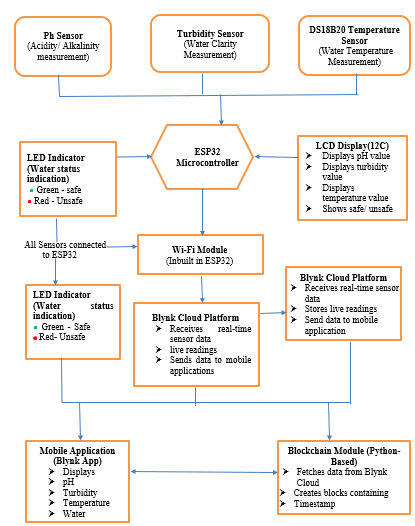
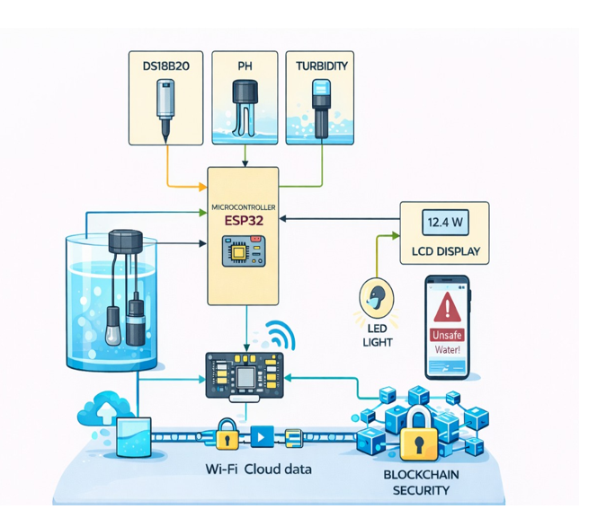
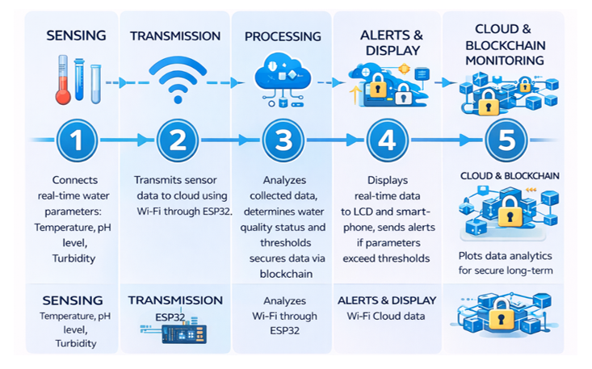
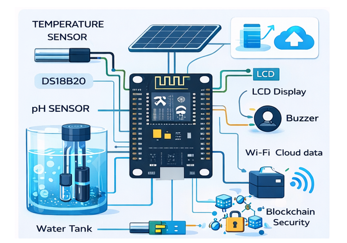
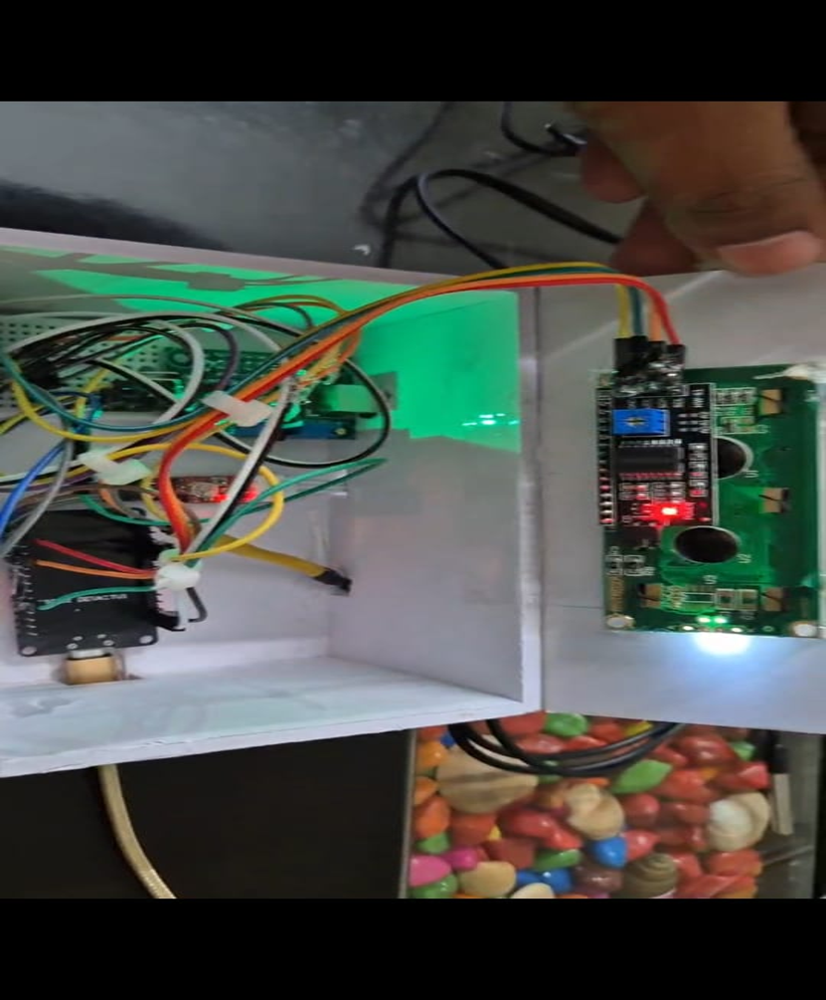

# Urban Aqua – Smart Residential Water Quality Detection System

## 📌 About the Project

Urban Aqua is an IoT-based smart residential water quality monitoring system designed to monitor water quality in real time.

The system uses an ESP32 microcontroller to collect water quality parameters such as pH, turbidity, and temperature. The collected data is displayed locally through an LCD and remotely monitored using the Blynk IoT platform.

A blockchain-inspired data integrity mechanism is also used to generate SHA-256 hashes and link sensor records to improve data integrity.

## 🎯 Objectives

- Monitor water quality parameters in real time
- Measure pH, turbidity, and temperature
- Display sensor readings on an LCD
- Enable remote monitoring through Blynk IoT
- Detect abnormal water quality conditions
- Improve sensor data integrity using hash-linked records

## 🛠️ Technologies Used

- ESP32
- Embedded C++
- Arduino IDE
- Python
- Blynk IoT
- SHA-256
- IoT Sensors
- I2C LCD

## 🔧 Hardware Components

- ESP32 Development Board
- pH Sensor
- Turbidity Sensor
- DS18B20 Temperature Sensor
- 16×2 I2C LCD
- Connecting Wires
- USB Cable
- Power Supply

## 💻 Software Components

### ESP32

The ESP32 collects sensor readings and processes the data before displaying it on the LCD and sending it to the Blynk IoT platform.

### Blynk IoT

Blynk is used for remote monitoring and real-time visualization of water quality parameters.

### Python Data Integrity Module

Python is used to implement the blockchain-inspired data integrity mechanism. Sensor readings are processed using SHA-256 hashing, with records linked using previous hash values.

## ⚙️ System Workflow

1. Sensors collect water quality data.
2. ESP32 receives the sensor readings.
3. The readings are processed by the ESP32.
4. Temperature, turbidity, and pH values are displayed on the LCD.
5. Data is transmitted through Wi-Fi to the Blynk IoT platform.
6. Sensor data can be monitored remotely.
7. Python generates SHA-256 hashes for data integrity.
## 🏗️ System Design

### System Architecture

### System Model

### Data Flow

### Hardware Interfacing

## 📊 Results

The system was tested under different water-quality conditions using temperature, turbidity, and pH sensors.

| Condition | Sensor | Measured Value | Response Time | Observation |
|---|---|---:|---:|---|
| Normal water condition | DS18B20 Temperature Sensor | 26°C – 29°C | < 1 sec | Stable and accurate readings |
| Clear water sample | Turbidity Sensor | 0 – 2 NTU | < 1 sec | Water classified as safe |
| Slightly contaminated water | Turbidity Sensor | 3 – 5 NTU | < 1 sec | Moderate turbidity detected |
| Neutral water | pH Sensor | 6.8 – 7.4 | < 2 sec | Acceptable drinking range |
| Acidic/Basic water | pH Sensor | < 6.5 or > 8.5 | < 2 sec | Unsafe water alert triggered |
## 📸 Project Outputs

### Hardware Prototype

### LCD Output

The LCD displays the measured temperature, turbidity, and pH values in real time.

### Blynk IoT Dashboard

The Blynk dashboard provides remote visualization of the water-quality parameters.

### Blockchain-Based Data Logging

The Python module creates hash-linked records using SHA-256 to improve the integrity of sensor data.
## 🚀 Future Scope

- Machine-learning-based water-quality prediction
- Monitoring multiple water tanks or sources
- Automated water-flow control
- Improved long-term water-quality analysis
- Expansion for residential and smart-city applications
- 
## 📂 Repository Contents

├── README.md
├── water_quality_monitor.ino
├── blockchain_data_integrity.py
├── hardware-prototype.png
├── system-architecture.png
├── system-model.png
├── dataflow.png
└── interfacing-diagram.png
